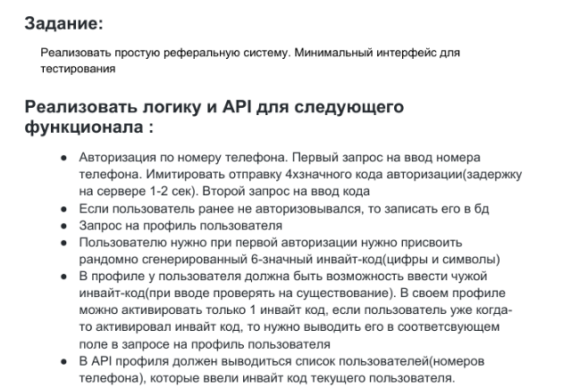
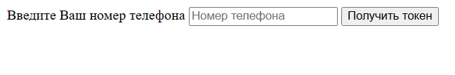
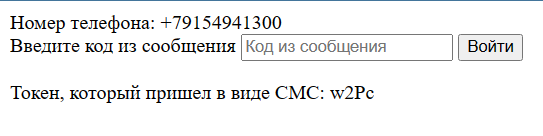
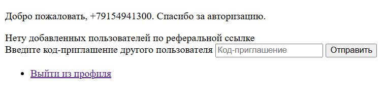
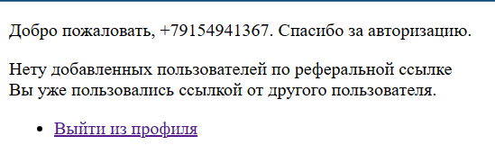
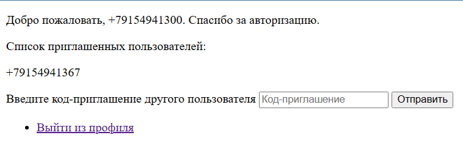

Реализация тестового задания на позицию Backend Django Developer

Техническое задание:

# Реализация:

## /auth , начало верификации пользователя, ввод номера телефона

При первом входе пользователя в стадию верификации данные сохраняются в базу данных.
Формируется уникальный инвайт код (единожды), а так же устанавливается пароль в виде токена(каждый раз уникально-новый при авторизации)
После отправки номера телефона редирект на /auth/login

## /auth/login

Текущий токен пользователя указан на странице, ограничена возможность пользователю вводить неверные данные.

## /auth/profile

Профиль пользователя.
Вывод списка приглашенных пользователей, формы для ввода чужой реферальной ссылки, а так же кнопка логаута.

## Добавление чужой реферальной ссылки:

Проверка ввода существующей реферальной ссылки, при отсутствии ссылки у всех пользователей выходит ошибка.

После добавления реально-существующей реферальной ссылки окно исчезает.

## Отображение списка добавленных пользователей:

После того, как кто-то воспользуется его ссылкой у него на странице будет данное отображение

*Добавить самого себя так же не получится.

## Установка

1. pip install -r requirements.txt (установка необходимых библиотек)

2. В файле hammerSystems/hammerSystems/setting.py указать данные локальной БД postgresql

3. cd hammerSystems

4. python manage.py migrate

5. python manage.py runserver
